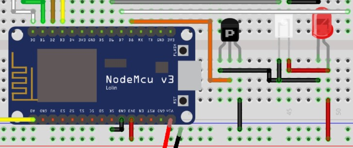
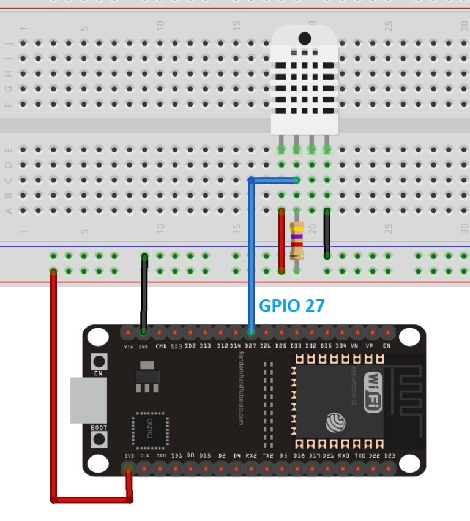
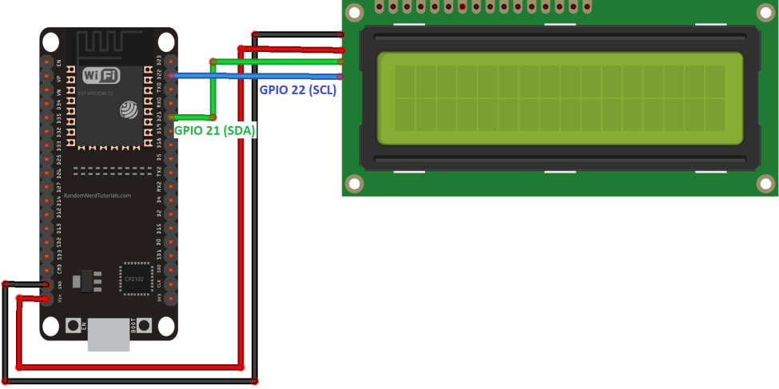

# Blynk-AC-Controller
This repository contains the final project for the class of Sensors and Actuators at Tec de Monterrey.

## Prerequisites
Blynk account:
- https://blynk.io/

IRremote8266 library:
- https://github.com/crankyoldgit/IRremoteESP8266

LiquidCrystal_I2C library:
- https://www.arduino.cc/reference/en/libraries/liquidcrystal-i2c/

DHT Sensor libraries (both needed):
- https://github.com/adafruit/Adafruit_Sensor
- https://github.com/adafruit/DHT-sensor-library

## Connections
Phototransistor Connection (**Note connection to 3.3v**)

DHT Sensor Connection

LCD i2c Connection

## Resources
- https://www.electronics-lab.com/project/esp8266-wifi-air-conditioner-remote-control/
- https://randomnerdtutorials.com/esp32-dht11-dht22-temperature-humidity-web-server-arduino-ide/
- https://randomnerdtutorials.com/esp32-esp8266-i2c-lcd-arduino-ide/
